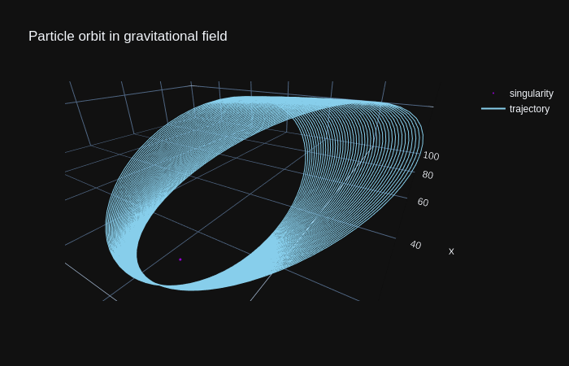

<p align="center">
  
</p>

-----------------

# Status

<!--[](https://circleci.com/gh/BjoB/gros)-->
<!--[](https://pypi.org/project/gros/)-->
[](https://circleci.com/gh/BjoB/gros)
[](https://img.shields.io/badge/powered--by-astropy-blue)
[](https://img.shields.io/badge/powered--by-plotly-blue)

# Overview

**gros** is a python package to numerically calculate and simulate particle trajectories based on the field equations of general relativity. A user needs to define a certain metric by providing the mass of a central gravitational attractor and the start coordinates and velocity of the test particle.

# Installation

Clone the repository from <https://github.com/BjoB/gros>. After this you can install the package via pip in your choosen environment:

```sh
pip install .
```

# Examples

Some simple simulations can be found in the [examples](https://github.com/BjoB/gros/tree/master/src/gros/examples) directory.

## Particle on Mercury's orbit

This example simulates a particle orbiting the sun with some initial orbital parameters taken from <https://nssdc.gsfc.nasa.gov/planetary/factsheet/>. After calculating the trajectory, an animation will be generated, which can be used to track the particle with a previously choosen step size.

<p align="center">
  
</p>

## Earth as a black hole

What if earth was a black hole? The according example shows how a particle would act in short distance of 100m. Especially the perihelion precession effect is visualized as a direct effect of general relativity:

<p align="center">
  
</p>
